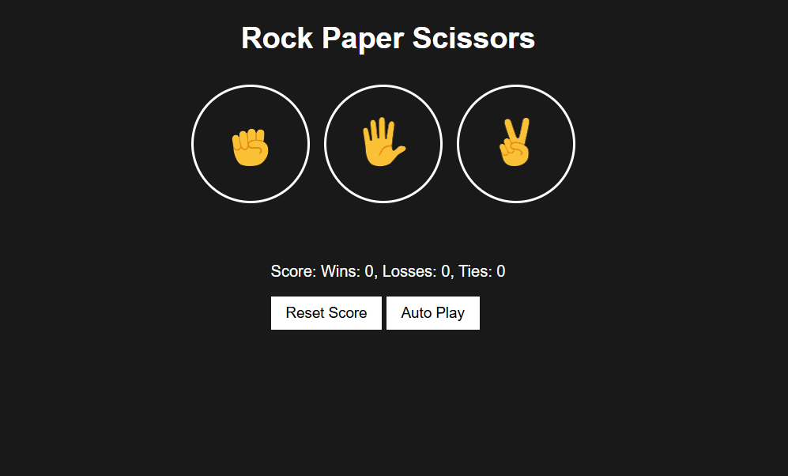

# Rock Paper Scissors Game ✊✋✌️

لعبة Rock Paper Scissors تفاعلية تتيح للمستخدم اللعب ضد الكمبيوتر مع تتبع النتائج.  
تم تنفيذ منطق اللعبة باستخدام JavaScript مع حفظ النتائج باستخدام **Local Storage** وواجهة بسيطة ومتجاوبة.

---

## 🔗 Live Demo  
👉 https://exquisite-gnome-c2db08.netlify.app/

## 🗂️ GitHub Repository  
👉 https://github.com/ahmed-moatemed/rock-paper-scissors

---

## 📸 Preview  



---

## 🚀 Features
- اللعب ضد الكمبيوتر (User vs Computer)  
- منطق لعب كامل (Rock / Paper / Scissors)  
- تتبع عدد مرات الفوز والخسارة والتعادل  
- حفظ النتائج باستخدام **Local Storage**  
- إعادة تعيين النتائج (Reset Score)  
- واجهة بسيطة وسلسة  
- Responsive Design يعمل على جميع الأجهزة  
- تجربة لعب خفيفة وسريعة

---

## 🛠️ Technologies Used
- **HTML5**  
- **CSS3**  
- **JavaScript (ES6+)**  
- **Local Storage**  
- **Responsive Design**

---

## 📦 Installation & Run Locally

```bash
# Clone repository
git clone https://github.com/ahmed-moatemed/rock-paper-scissors.git

# Open project folder
cd rock-paper-scissors

# Run the game
Open index.html in your browser
```

---

## 📝 Notes
- يتم حفظ النتائج تلقائيًا في Local Storage.  
- يمكن تطوير اللعبة بإضافة:
  - مستويات صعوبة  
  - مؤثرات صوتية  
  - Animations أقوى  
  - نظام لاعبَين (Player vs Player)  
  - تصميم جديد للواجهة  

---

## ✨ Author
Developed by **Ahmed Ibrahim Moatemed**  
📧 Email: matamedahmed@gmail.com  
🔗 Portfolio: https://mo3temed.netlify.app/
